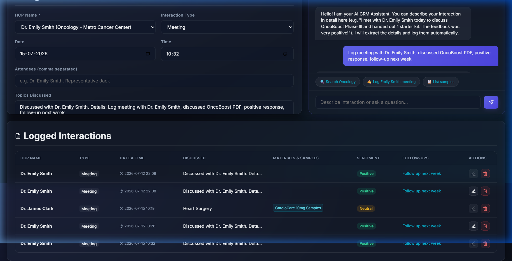
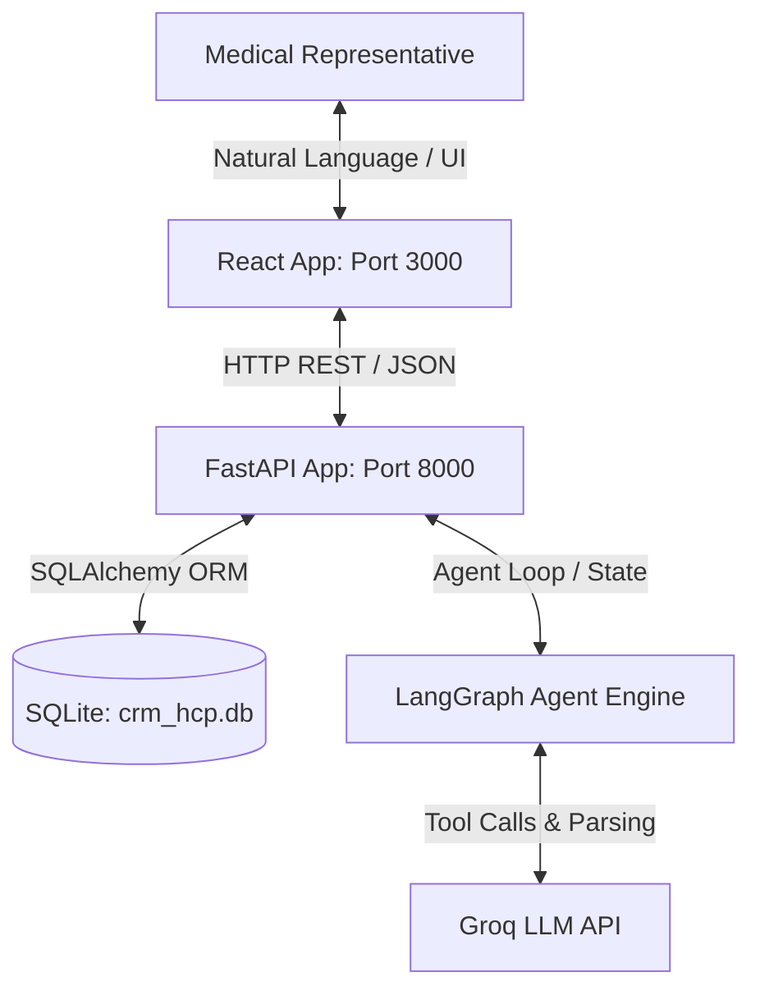

# AuraCRM 🩺🤖

AuraCRM is an AI-First Healthcare Professional (HCP) CRM system designed to streamline physician relationship management, interaction logging, and clinical materials tracking. Powered by a React frontend and a FastAPI backend with LangGraph/LangChain agentic workflows, it enables medical representatives to log interactions, query materials, and search HCP databases through natural conversation.



---

## 🚀 Tech Stack

AuraCRM is built using a modern, performant, and fully decoupled tech stack:

### **Frontend**
*   **Vite + React (v18)** - Fast build tooling and component-based UI.
*   **Redux Toolkit** - Global state management for active HCPs, materials, and chat interactions.
*   **Tailwind CSS** - Modern, clean, and responsive design.
*   **Lucide React** - High-quality iconography.

### **Backend**
*   **FastAPI** - High-performance asynchronous Python web framework for RESTful APIs.
*   **SQLAlchemy** - Powerful SQL toolkit and Object-Relational Mapper (ORM).
*   **SQLite** - Lightweight relational database used for local persistence.
*   **Uvicorn** - Lightning-fast ASGI server implementation.

### **AI & Agentic Workflows**
*   **LangGraph & LangChain** - Orchestrates the agentic multi-turn conversation and function-calling workflow.
*   **Groq API (Llama3 Models)** - Supercharged, low-latency LLM inference to parse user queries, execute tool calls, and auto-populate forms.

---

## 📂 Folder Structure

```filepath
AuraCRM/
├── backend/
│   ├── agent.py            # LangGraph agent state, nodes, and tool integrations (FastAPI <-> LLM)
│   ├── database.py         # SQLAlchemy engine setup and DB session helpers
│   ├── main.py             # FastAPI application, CORS settings, routes (/api/hcps, /api/chat, etc.)
│   ├── models.py           # SQLAlchemy database schemas (HCP, Material, Interaction)
│   └── requirements.txt    # Python backend package dependencies
├── frontend/
│   ├── public/             # Static public assets
│   ├── src/
│   │   ├── components/     # UI Components (Dashboard, Chatbox, InteractionLog, etc.)
│   │   ├── store/          # Redux slices and store configuration
│   │   ├── App.jsx         # Main application container
│   │   ├── index.css       # Tailwind/Global styling rules
│   │   └── main.jsx        # React application entry point
│   ├── package.json        # Frontend NPM dependencies and scripts
│   └── vite.config.js      # Vite dev server configuration (custom port: 3000)
├── .env.example            # Environment variables template
├── .gitignore              # Ignored files (node_modules, pycache, DBs, and local configs)
└── README.md               # Project documentation
```

---

## ⚙️ Workflow & System Architecture



1.  **User Input:** The medical representative types a prompt (e.g., *"Search for Dr. Emily and log an oncology review today at 3 PM"*).
2.  **API Call:** The frontend sends the prompt along with the conversation history to the `/api/chat` backend endpoint.
3.  **Agent Reasoning:** The LangGraph agent executes a loop:
    *   It evaluates the input using the Llama3 model on Groq.
    *   It decides if a tool call is needed (e.g., `search_hcp_fn` or `log_interaction_fn`).
    *   It executes the tool, queries the SQLite database, and feeds the results back to the LLM.
4.  **State Synthesis:** The agent updates the conversational state, auto-populates the corresponding form fields, and replies to the user.
5.  **UI Sync:** The frontend receives the chat reply and structural form data, immediately updating the Redux store to refresh the UI and log lists.

---

## ✨ Core Features

*   **Smart Conversational Agent:** Talk to AuraCRM to fetch materials, search HCP lists, or automatically fill out complex interaction logs without manual data entry.
*   **HCP Directory Management:** Centralized view of all doctors, including names, specialties, clinic locations, and contact info.
*   **Inventory & Stock Tracking:** Real-time stock counts for marketing leaflets, PDFs, clinical study papers, and drug samples.
*   **Automatic Inventory Deductions:** Automatically decrements sample stocks when logged interactions indicate sample distribution.
*   **Sentiment & Outcome Logging:** Tracks the positive, neutral, or negative feedback of meetings to build better relationship pipelines.

---

## 🔮 Future Implementations

To scale AuraCRM into an enterprise-ready healthcare solution, the following additions are planned:

1.  **Multi-Channel Scheduling:** Integrated calendar invites (Google Calendar/Outlook) generated by the agent upon logging a follow-up action.
2.  **Interactive Analytics Dashboard:** Add visual graphs and charts tracking sample distribution velocity, sentiment trends over time, and representative visit metrics.
3.  **Offline-First Support:** Service workers and IndexedDB storage on the frontend to allow logging interactions in clinics without cellular connection, syncing when online.
4.  **Advanced Security & Compliance:** Standardized HIPAA-compliant logging, data encryption at rest and in transit, and role-based access control (RBAC).
5.  **Voice-to-Text Integration:** Direct voice input in the chat window so medical reps can dictate logs on the go from mobile devices.
